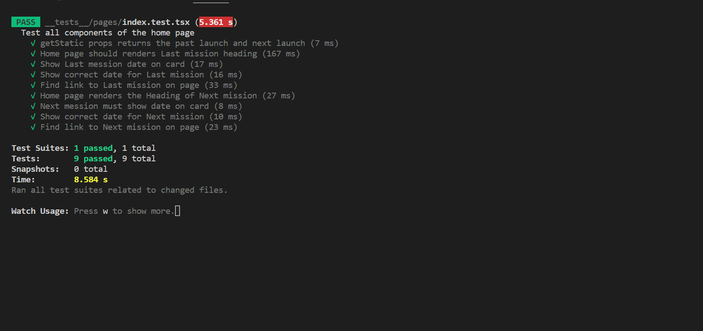

# Space X Rocket Launch Date

Space-X Launche date is an app that gets you the latest dates of rocket launches including pasted, failed or successful launches. The launch data is retrieved from the spacex-graph-ql API [https://api.spacex.land/graphql/](https://api.spacex.land/graphql/).
The home page presents you with two cards, latest launch and next comming launch, when you click on the card it give details of the launch.


## Tech Stack

React JS, Next JS, TypeScript, GraphQL and Tailwind CSS.

## Installationand getting Started

To get started with the project, make sure that you have Node installed on your machine and run the following commands:

```bash
- git clone https://github.com/DeMutombo/space-x-launches.git
- cd into project
- npm install
- npm run dev
# or
- yarn dev
```

Open [http://localhost:3000](http://localhost:3000) with your browser to see the result.

## Testing

For testing, the app uses Jest which is shipped with React and to run the tests use the following command (You should see the result as in the image below):

```bash
- npm test .
```




## Improvements

Making the app more mobile responsive, implementing test on each page to insure that all the data is loaded and displays correctly. 
